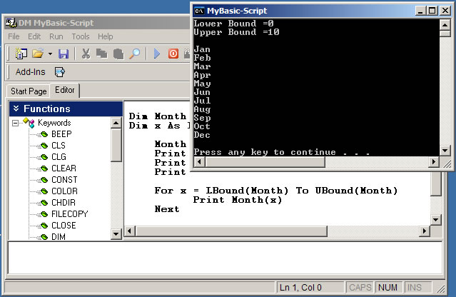



## DM MyBasic\-Script Version 1\.2

### Description

Hi All this is the new version of my Basic scripting Language. I know it's a little late but I been busy. Ok some new keywords have now been added about 15, Support for 3 basic loop types, For Loop, While Loop, Loop Until, More example scripts added., Select Case added, Loads of new string and math functions added., New IDE updates, Plug-ins support for IDE added and Plug-in template added to make your own. Plus a large update to the Help file. Note Live update program is also included. Though I not got the site ready so check from time to time.

Ok that all next version be in about a week Please Vote
 
### More Info
 

             |
---                |---
**Submitted On**   |2005-05-26 04:18:36
**By**             |[dreamvb](https://github.com/Planet-Source-Code/PSCIndex/blob/master/ByAuthor/dreamvb.md)
**Level**          |Intermediate
**User Rating**    |5.0 (60 globes from 12 users)
**Compatibility**  |VB 5\.0, VB 6\.0
**Category**       |[Coding Standards](https://github.com/Planet-Source-Code/PSCIndex/blob/master/ByCategory/coding-standards__1-43.md)
**World**          |[Visual Basic](https://github.com/Planet-Source-Code/PSCIndex/blob/master/ByWorld/visual-basic.md)
**Archive File**   |[DM\_MyBasic1892895262005\.zip](https://github.com/Planet-Source-Code/dreamvb-dm-mybasic-script-version-1-2__1-60706/archive/master.zip)

